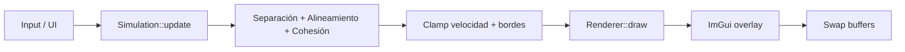

# Laboratorio 10 — Simulación de Boids

Simulación de **comportamiento colectivo** inspirada en bandadas de aves, cardúmenes de peces y enjambres. Cada agente (Boid) aplica reglas locales de interacción; del conjunto emerge un movimiento grupal complejo.

Implementado en **C++17**, **OpenGL 3.3 Core**, **GLFW**, **GLM** e **ImGui**.

[](https://raw.githubusercontent.com/OwenRoque/boids/master/img/boids_simulation.webm)

---

## Características

| Features | Implementación |
|-----------|----------------|
| Estructura Boid (posición, velocidad, dirección) | `src/Boid.h` |
| Población ≥ 50 Boids aleatorios | Por defecto 80; ajustable 10–500 |
| Representación visual orientada | Triángulo 2D instanciado, alineado con `direction` |
| Movimiento continuo | `position += velocity * dt` cada frame |
| Separación | Fuerza de repulsión si distancia < `separationDistance` |
| Alineamiento | Hacia la velocidad promedio de vecinos |
| Cohesión | Hacia el centro de masa de vecinos |
| Velocidad | `clampSpeed()` en cada Boid |
| Parámetros en tiempo real | Panel ImGui lateral |

---

## Dependencias

### Linux (Ubuntu/Debian)

```bash
sudo apt update
sudo apt install build-essential cmake libglfw3-dev libgl1-mesa-dev
```

**GLM** e **ImGui** se descargan automáticamente con CMake (`FetchContent`).  
**GLAD** (cargador OpenGL 3.3) está en `third_party/glad_gen/`.

### Regenerar GLAD (opcional)

```bash
pip install glad
python3 -m glad --generator c --api gl=3.3 --profile core \
  --out-path third_party/glad_gen
```

---

## Compilación

```bash
mkdir -p build && cd build
cmake ..
cmake --build . -j$(nproc)
```

El ejecutable queda en `build/boids_lab`. Los shaders se copian a `build/shaders/`.

### Ejecución

Desde el directorio `build/`:

```bash
./boids_lab
```

> Ejecutar desde `build/` para que encuentre `shaders/boid.vert` y `shaders/boid.frag`.

---

## Arquitectura del proyecto

```
lab 10/
├── CMakeLists.txt
├── README.md
├── shaders/
│   ├── boid.vert          # Vertex shader (instancing + rotación)
│   └── boid.frag
├── src/
│   ├── main.cpp           # Ventana GLFW, bucle principal, ImGui
│   ├── Boid.h / Boid.cpp  # Agente individual
│   ├── Simulation.h / Simulation.cpp  # Reglas de flocking
│   └── Renderer.h / Renderer.cpp        # OpenGL instanced rendering
└── third_party/
    └── glad_gen/          # GLAD OpenGL 3.3 Core
```

### Flujo por frame



---

## Modelo Boid

Cada agente almacena:

- **position** (`glm::vec2`): coordenadas en píxeles de la ventana.
- **velocity** (`glm::vec2`): vector de velocidad actual.
- **direction** (`glm::vec2`): versión normalizada de la velocidad (orientación visual).

### Reglas de Reynolds

1. **Separación** — Evita colisiones. Para cada vecino más cercano que `separationDistance`, acumula un vector alejamiento ponderado por `1/d²`.

2. **Alineamiento** — Iguala la dirección con el promedio de velocidades de vecinos dentro de `neighborDistance`.

3. **Cohesión** — Se desplaza hacia el centro de masa de los vecinos en el radio de percepción.

La aceleración final es:

```
a = w_sep * steer_sep + w_ali * steer_ali + w_coh * steer_coh
```

Cada `steer_*` se limita con `maxForce`. Tras integrar, la velocidad se acota entre `minSpeed` y `maxSpeed`.

### Comportamiento en bordes

- **Mundo toroidal**: al salir por un borde, reaparece por el opuesto.
- **Rebote**: fuerza de giro suave cerca del borde e inversión de velocidad si se cruza el límite.

---

## Renderizado

- Vista **2D ortográfica** (eje Y hacia abajo, coherente con coordenadas de pantalla).
- Cada Boid es un **triángulo isósceles** (instanced rendering).
- El vertex shader rota la figura según `direction` y la traslada a `position`.
- Colores ligeramente distintos por índice para distinguir agentes.

---

<!--## Experimentos sugeridos

1. **Solo separación** — Peso alineamiento y cohesión en 0: los agentes se dispersan.
2. **Solo alineamiento** — Patrones de movimiento paralelo sin agrupación fuerte.
3. **Solo cohesión** — Agrupación sin evitar choques (colisiones visibles).

4. **Equilibrio clásico** — Valores por defecto: bandada coherente.
5. **Toroidal vs rebote** — Comparar continuidad del grupo en los bordes.
6. **Efecto de densidad** — Subir a 300+ Boids y reducir `neighborDistance`.
-->

